# Harjoitus 5

Tämän harjoituksen tavoitteena oli opetella käyttämään Saltin muotteja, sekä luoda muutamia tiloja Saltin tavallisia toimintoja käyttäen.

Olen ennen harjoituksen tekoa asentanut uuden 64-bittisen Xubuntu orja-koneen **'e008'**, ja tähän openssh-serverin SSH-yhteyttä varten käyttäen [tekemääni skriptiä.](https://github.com/rootElmo/Agent-Setter)

### Hello templates! Tee muotilla esimerkkitiedosto, jossa on muuttujien (esim grains) arvoja.

Aloitin luomalla uuden tilan, ja tälle kansion **hellojinja** sijaintiin ***/srv/salt/***. Loin tilalle tarvittavan _init.sls_-tiedoston komennolla

	master $ echo "" | sudo tee init.sls

Kirjoitin init.sls:än alustavasti seuraavaan muotoon:

	/tmp/hello.txt:
	  file.managed:
	    - source: salt://hellojinja/hello.txt

Loin seuraavaksi tarvittavan _hello.txt_-tiedoston komennolla

	echo "Hello world" | sudo tee hello.txt

ja katsoin, oliko tiedosto paikallaan _cat_ komennolla.

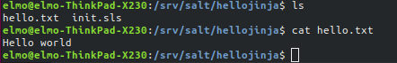

Ajoin tämän jälkeen tilan aktiiviseksi:

	master $ sudo salt 'e008' state.apply hellojinja

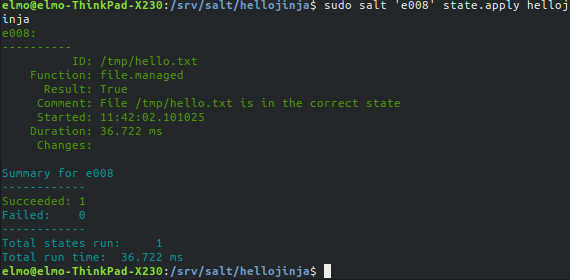

Testasin seuraavaksi Saltin avulla herra-koneelta, oliko tiedosto oikeasti paikallaan ja sisälsikö se sen, mitä olin sinne kirjoittanut

	master $ sudo salt 'e008' cmd.run 'cat /tmp/hello.txt'

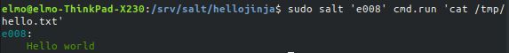

Homma pelittää tähän asti!

Seuraavaksi muutin _hello.txt_-tiedoston seuraavaan muotoon:

	Your agent-computer's CPU is {{ grains[cpu_model] }}

ja _init.sls_-tiedoston seuraavaan muotoon:

	/tmp/hello.txt:
	  file.managed:
	    - source: salt://hellojinja/hello.txt
	    - template: jinja

Ajoin tilan aktiiviseksi, mutta sain virheilmoituksen:

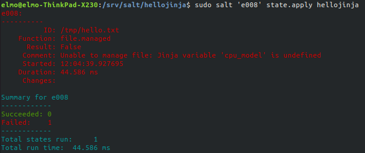

Muuttujaa 'cpu_model' ei selvästikään oltu määritelty. En ihan ymmärtänyt tätä laajemmassa kontekstissam joten päätin lueskella internetistä ohjeita ja dokumentaatiota.

Pienin kikkailun ja kokeilun jälkeen kokeilun jälkeen sain kuin sainkin tiedoston toimimaan. Ongelmana olivat olemattomat hapsut 'cpu_model':in ympärillä. _hello.txt_ näytti näiden toimenpiteiden jälkeen tältä:

	Your agent-computer's CPU is {{ grains['cpu_model'] }}

Tila siis ajautui onnistuneesti ja tiedossa oli grainsista saatu oikea tieto orja-koneella:

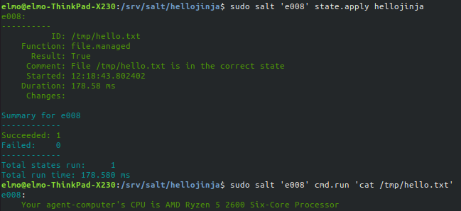

## Message of the Day

Tämän tehtävän tavoitteena oli muokata Ubuntun antamaa motd:ia, kun koneelle kirjaudutaan sisään, tai otetaan yhteys SSH:lla. Tällaisesta nivaskasta on siis kyse:

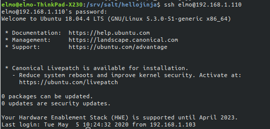

Otin siis yhteyden orja-koneelle SSH:lla ja tämän onnistuttua sain tervehdykseksi kyseisen motd:in.

Aloitin luomalla kansion **motdTemp** sijaintiin ***/srv/salt*** uuden salt-tilan luomiseksi. Loin myös _init.sls_-tiedoston

	/etc/motd:
	  file.managed:
	    - source: salt://motdTemp/motd

Ja siirrettävän _motd_-tiedoston. Tiedostossa tällä hetkellä vain teksti '_Terve!_'.

Ubuntu luo automaattisesti oman motd:insa tiettyjen skriptien mukaan ja tämän _motd_-tiedoston sisällön pitäisi näkyä tämän aikaisemman motd:in perässä.

Ajoin seuraavaksi luomani tilan aktiiviseksi, joka onnistui. Tämän jälkeen tarkastin _motd_-tiedoston olemassaolon orja-koneelta.

	master $ sudo salt 'e008' state.apply motdTemp
	master $ sudo salt 'e008' cmd.run 'cat /etc/motd'

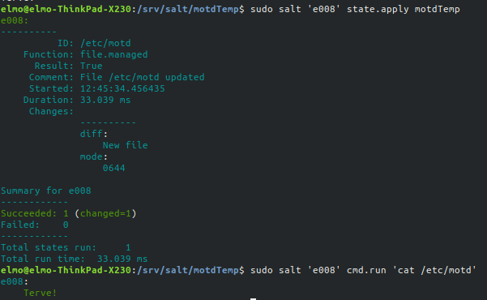

Tämän jälkeen katsoin, näkyisikö uusi motd SSH-yhteyden onnistuessa orja-koneelle. Terminaalin tuloste saadusta motdista:

	elmo@192.168.1.110's password: 
	Welcome to Ubuntu 18.04.4 LTS (GNU/Linux 5.3.0-51-generic x86_64)

	 * Documentation:  https://help.ubuntu.com
	 * Management:     https://landscape.canonical.com
	 * Support:        https://ubuntu.com/advantage

	 * Canonical Livepatch is available for installation.
	   - Reduce system reboots and improve kernel security. Activate at:
	     https://ubuntu.com/livepatch

	0 packages can be updated.
	0 updates are security updates.

	Your Hardware Enablement Stack (HWE) is supported until April 2023.
	Terve!
	Last login: Tue May  5 12:28:39 2020 from 192.168.1.103

_motd_-tiedostoon kirjoittamani '_Terve!_' näkyy saamassani motd:issa! Ajattelin seuraavaksi poistaa automaattisesti skripteillä luodun motd:in ennen kuin muokkaisin omaa motd:iani yhtään pidemmälle.

Olin jo oppinut, että Ubuntu luo motd:insa skripteistä, jotka sijaitsevat kansiossa ***/etc/update-motd.d***. Tehtävänä olisi siis tyhjentää tuo kansio. Loin _motdTemp_-tilaan uuden kansion _update-motd.d_ ja sinne tiedoston _important.txt_, jotka vietäisiin orja-koneelle samannimisen kansion tilalle. Muokkasin myös _init.sls_-tiedoston seuraavanlaiseksi:

	/etc/update-motd.d:
	  file.recurse:
	    - clean: True
	    - source: salt://motdTemp/update-motd.d

	/etc/motd:
	  file.managed:
	    - source: salt://motdTemp/motd

_file.recurse_ vie kansion tiedostoineen ja _clean: True_ putsaa ensiksi alta kaiken jo siellä olevan.

Ajoin tilan aktiiviseksi ja se onnistui! Viestistä näkyy myös, että skriptitiedostot katosivat orja-koneen _update-motd.d_-kansiosta:

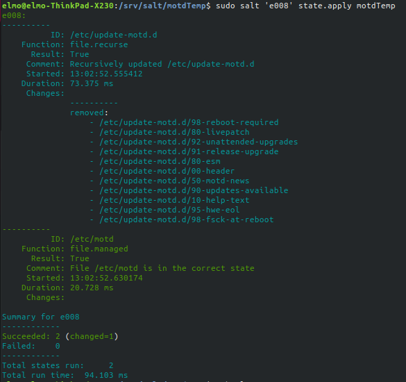

Testasin näkyykö motd:ssa enää vain pelkkä 'Terve!'

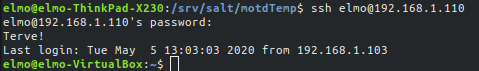

Ja näin näyttää näkyvän! Homma siis pelittää tähän asti.

Tein pari muutosta _motd_-tiedostoon; hakisin grainsilla tietoja orja-koneesta ja lisäisin ne motd:iin. Muokkasin samalla _init.sls_-tiedoston muottien käyttöä varten. Prosessi oli hyvin samanlainen, kuin aikaisemmassa tehtävässä.

init.sls tämän jälkeen:

	/etc/update-motd.d:
	  file.recurse:
	    - clean: True
	    - source: salt://motdTemp/update-motd.d

	/etc/motd:
	  file.managed:
	    - source: salt://motdTemp/motd
	    - template: jinja

motd myös muokattuna:

	Hello!

	Logged into agent '{{grains['id']}}'
	OS: {{ grains['osfullname'], grains['osrelease'] }} 

Ajoin tilan aktiiviseksi onnistuneesti ja testasin SSH:lla, tulisiko motd:iin tehdyt muutokset.

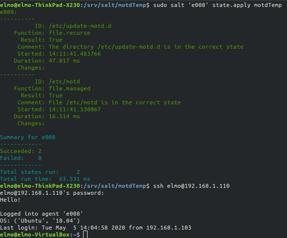

Näin tapahtui! Tämä tehtävä ja viimeinen extra-tehtävä saatiin siis tehtyä onnistuneesti!

## Bash. Tee bashiin asetuksia Saltilla

Olin jo oppinut harjoituksessa 4, että ohjelmien käyttäjäkohtaiset asetustiedostot löytyisivät kunkin käyttäjän kotihakemistosta. Kävin orja-koneella SSH:n kautta katselemassa kotihakemistoa ja komennolla

	agent $ ls -a

löysin tiedoston _.bashrc_, jonka oletin olevan bashin asetustiedosto. Lueskelin vähän netistä ja oletukseni oli oikeasa. Löysin samalla [suht kattavan artikkelin](https://vitux.com/how-to-customize-ubuntu-bash-prompt/) bashin asetuksien muuttamisesta. Päätin käyttää sitä apuna.

Otin SSH-yhteyden orjakoneelle ja kokeilin erilaisia bashin kustomointi-temppuja.

Aluksi tein kuten linkatussa artikkelissa oli tehty; tallensin PS1:n eli bashin oletusasetukset DEFAULT-muuttujaan

	slave $ DEFAULT=$PS1

Jos sössisin jotenkin bashin kustomoinnin voisin komennolla

	PS1=$DEFAULT

palauttaa alkuperäiset asetukset.

Tämän jälkeen kikkailin vähän värien ja muiden kanssa:

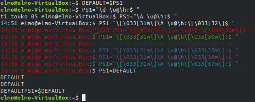

Palautin myös asetukset normaaleiksi. Kopion tämän jälkeen _.bashrc_-tiedoston herra-koneella luomaani kansioon ***/srv/salt/bashtest***, jotta voisin tehdä salt-tilan ja ajaa bashiin tehdyt muutokset orja-koneelle. Loin tilaa varten kansioon _init.sls_-tiedoston:

	/home/elmo/.bashrc:
	  file.managed:
	    - source: salt://bashtest/.bashrc

Ajoin tilan onnistuneesti aktiiviseksi.

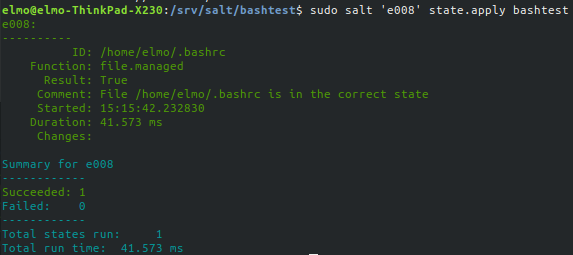

Muutin tämän jälkeen _bash.rc_-tiedostossa kohtaa, jossa promptin väri määritellään vihreäksi. Halusin sen luonnollisesti punaiseksi pelottaakseni mahdolliset tunkeutujat räikeällä ulosannillani.

Maalattuna muutettu värikoodi:

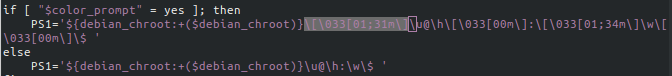

Ajoin tilan onnistuneesti aktiiviseksi ja testasin SSH:lla, olisiko muutos voimassa.

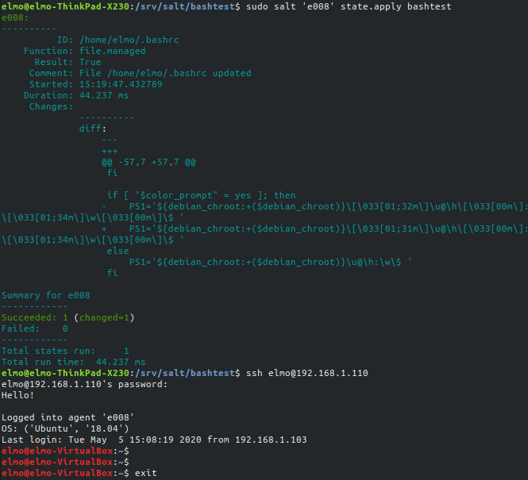

Ja homma pelittää niinkuin pitää! Päätin vielä lisätä kellon ajan muuttamalla _.bashrc_-tiedostoa samalla tavalla. Pitkähköön PS1:n määritelmään täytyisi lisätä '\A ' heti punaisen värin määrittelyn jälkeen.

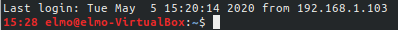

Tämä onnistui!

## Lähteet

Tero Karvinen: http://terokarvinen.com/2020/configuration-managment-systems-palvelinten-hallinta-ict4tn022-spring-2020/

SALTSTACK: https://docs.saltstack.com/en/master/topics/tutorials/states_pt3.html, https://docs.saltstack.com/en/getstarted/config/jinja.html

Linuxconfig: https://linuxconfig.org/how-to-change-welcome-message-motd-on-ubuntu-18-04-server
